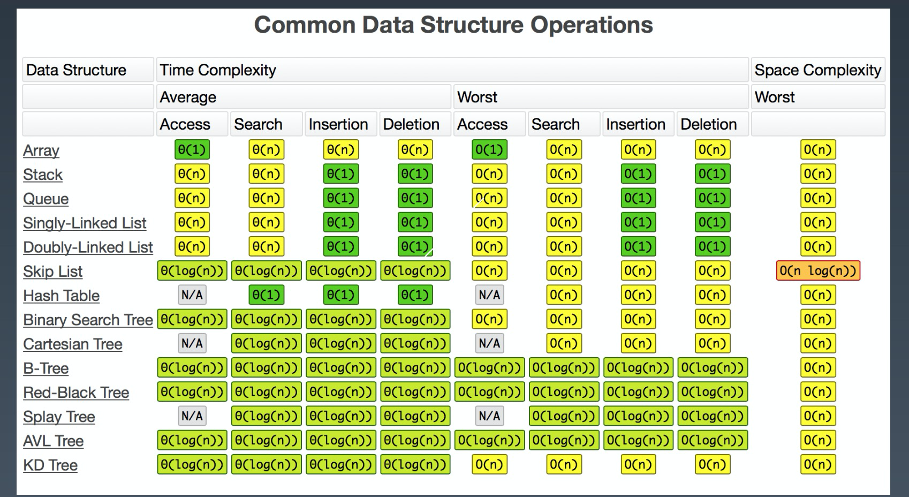

# 第二周

- [第二周](#第二周)
  - [复杂度图](#复杂度图)
  - [哈希表(Hash Table)](#哈希表hash-table)
    - [Hash 表工程实现](#hash-表工程实现)
  - [树](#树)
    - [树遍历](#树遍历)
  - [图](#图)
    - [DFS](#dfs)
    - [BFS](#bfs)


## 复杂度图



## 哈希表(Hash Table)

* 哈希表(Hash Table)也叫散列表，是根据关键码值（Keyvalue）而直接进行访问的数据结构。它通过把关键码值映射到表中一个位置来访问记录，以加快查找的速度。这个映射函数叫作散列函数（HashFunction），存放记录的数组叫作哈希表（或散列表）。

* Hash 函数映射到下标
  * 哈希函数
  * 底层存储物理结构: 数组
  * 哈希碰撞:(完美哈希)
    * 拉链式: 不同的元素经过哈希函数映射(解决方法拉链式解决冲突: 增加维度)
    * 正常情况下(O(1))

* 哈希表底层物理存储实现
  * 哈希表
  * 二叉树

* Map, Set
  * 哈希表抽象出来的高级抽象
  * Map: Key 不重复, 值可以重复
  * Set: 不允许出现重复的元素

### Hash 表工程实现

* 电话号码
* 用户信息表
* 缓存(LRU Cache)
* 键值对存储(Redis)

## 树

* 二维结构

```go
 // 节点结构
 type TreeNode struct {
     Val int
     Left *TreeNode
     Right *TreeNode
 }
```

### 树遍历

* 前序: 根左右
* 中序: 左根右
* 后序: 左右根
  * 递归写法处理顺序与遍历顺序一致

## 图

* Deep First Search DFS (深度优先搜索)
* Breath First Search BFS (广度优先搜索)

* 无向无权
* 有向无权
* 无向有权

### DFS

### BFS