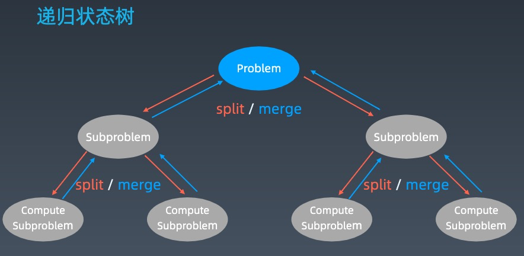
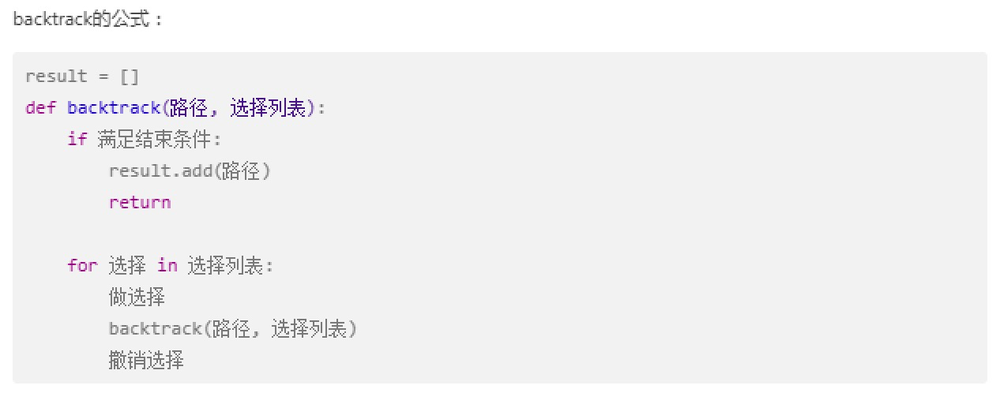

# 第三周

* 递归 & 分治回溯

1. [第三周](#第三周)
   1. [递归 (recursion)](#递归-recursion)
      1. [模板代码](#模板代码)
   2. [分治  (divide & conquer)](#分治--divide--conquer)
      1. [模板代码](#模板代码-1)
   3. [回溯 (backtracking)](#回溯-backtracking)

## 递归 (recursion)

* 重复性
* 结束条件
* 进入条件
* 编写经验
  * 不熟悉问题可以适当写出几层递归条件
  * 最近重复子问题
* 数学归纳法思维
  * n 次之后该条件仍然成立
  * 重复子问题是一样的解决办法

### 模板代码

```python
def recursion(level, param1, param2, ...):
    # recusion terminator, 递归终止条件
    if level > Max_lEVEL:
        process_result
        return

    # process logic in current level 处理当前层
    process(leve, data...)

    # 进入下一级
    self.recursion(level + 1, p1, ...)

    # reverse the current level status if needed
    # 清扫当前层信息
```

## 分治  (divide & conquer)

* 特殊的递归
* 问题化解成子问题
* 进入 Split 回归 Merge (Map Reduce)



### 模板代码

```python
def divide_conquer(problem, param1, param2, ...):

    if problem is None:
        print_result
        return

    # prepare data
    data = prepare_data(problem)
    subproblems = split_problem(problem, data)

    # conquer subproblems 分解问题
    # 问题需要分解不同场景
    subresult1 = self.divide_conquer(subproblems[0], p1, ...)
    subresult2 = self.divide_conquer(subproblems[1], p1, ...)
    subresult3 = self.divide_conquer(subproblems[2], p1, ...)

    ...

    # process and generate the final result
    # 合并结果
    result = process_result(subresult1, subresult2, subresult3, ...)

    # revert the current level states
```

## 回溯 (backtracking)

回溯法采用试错的思想，它尝试分步的去解决一个问题。在分步解决问题的过程中，当它通过尝试发现现有的分步答案不能得到有效的正确的解答的时候，它将取消上一步甚至是上几步的计算，再通过其它的可能的分步解答再次尝试寻找问题的答案。

回溯法通常用最简单的递归方法来实现，
在反复重复上述的步骤后可能出现两种情况：

* 找到一个可能存在的正确的答案；
* 在尝试了所有可能的分步方法后宣告该问题没有答案。

在最坏的情况下，回溯法会导致一次复杂度为指数时间的计算。回溯

* 从一条路往前走，能进则进，不能进则退回来，换一条路再试
  * 根据逻辑中断问题

